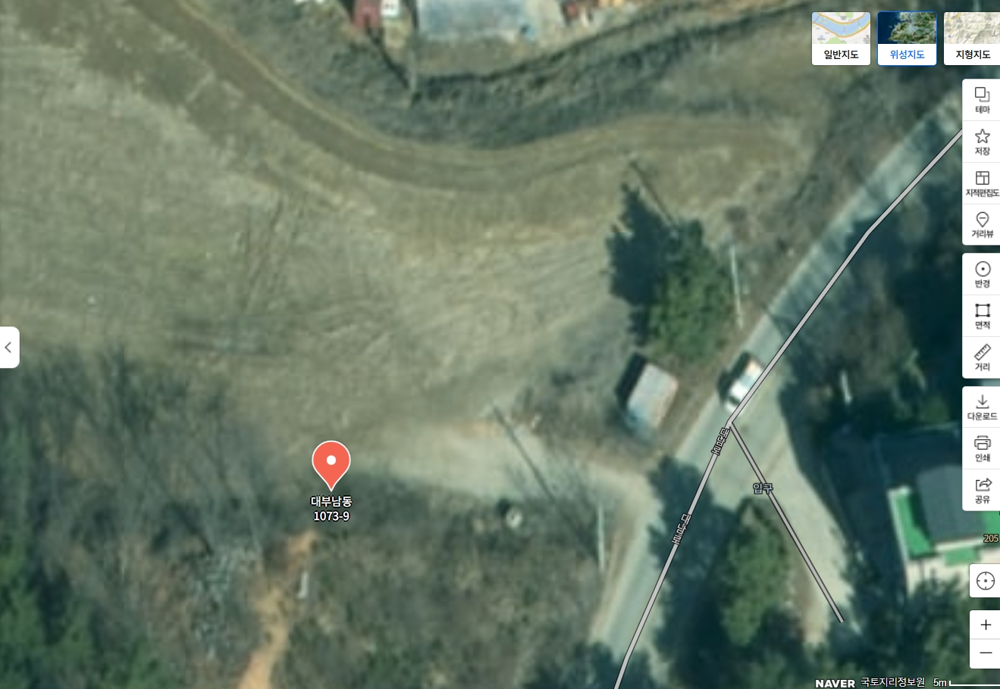

<!DOCTYPE html>
<html lang="ko">
<head>
    <meta charset="UTF-8">
    <meta name="viewport" content="width=device-width, initial-scale=1.0">
    <title>AI 한국사 심화 퀴즈</title>
</head>
<body>

<h1>📚 AI 한국사 심화 퀴즈</h1>

<h2>문제 1 / 10</h2>

다음 문화재가 만들어진 시대는?

  

<button>① 신라</button>  

<button>② 고려</button>  

<button>③ 조선</button>  

<button>④ 대한제국</button>

</body>
</html>